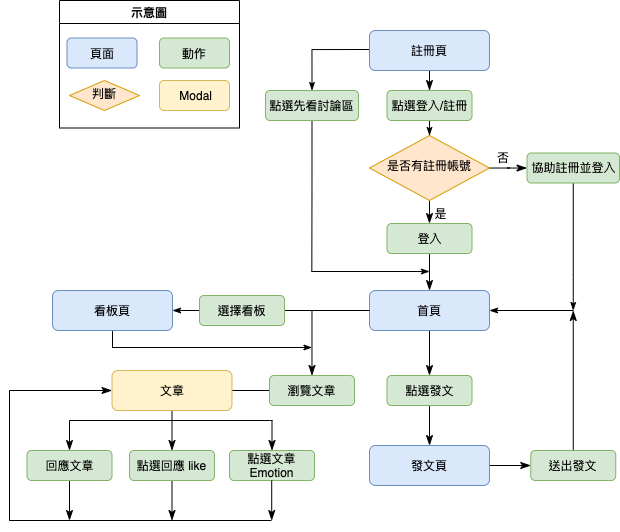
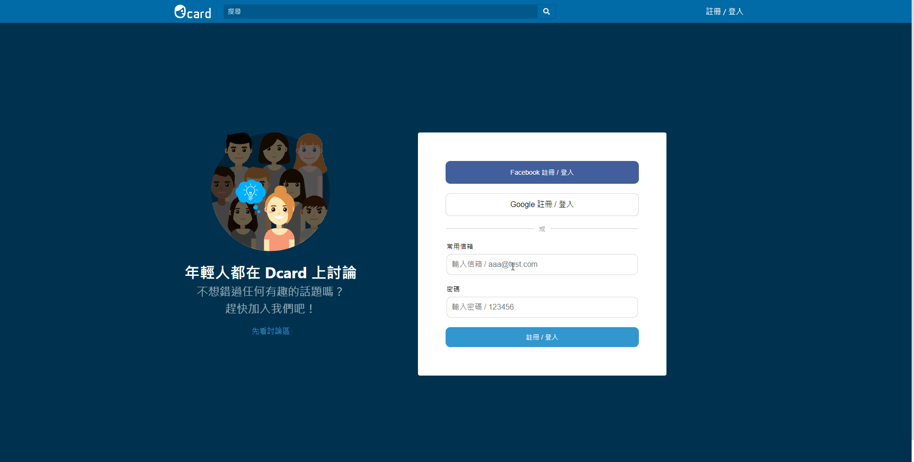
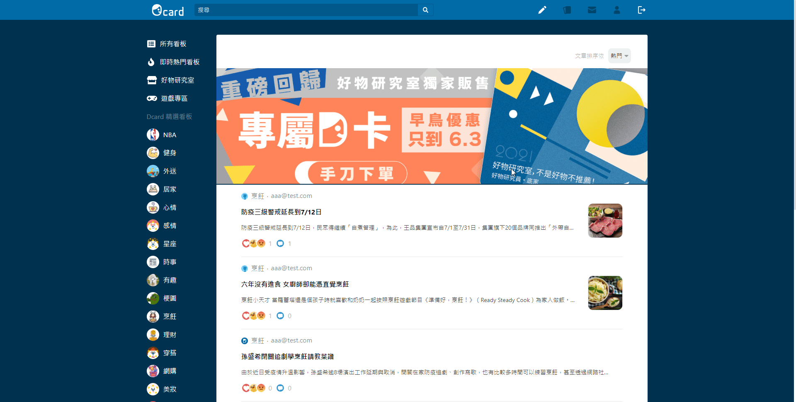

<!-- # Getting Started with Create React App -->

  

  

   This is a social media website, platforms allow users to have conversations, share information and create web content, enjoy it.
     
    <a href="https://ocard-15db3.web.app/"><strong>View Website »</strong></a>
     
  
 

## Technologies

### Front-End Fundamental

* HTML
* CSS
* JavaScript (ES2015)

### Front-End Frameworks & Libraries

* React
* React Hooks
* React Router
* Redux
* Material-UI
* animated-css

### Firebase Services

* Authentication
* Cloud Firestore
* Cloud Storage
* Cloud Function
* Hosting

### Tool for Development

* Node Package Manager (NPM)
* ESLint
* Prettier

## Flow Chart

## Website Demo

* Login as Resident by general account

* Write a post and upload image

* Browse the post and make comment, and
you can click emotion button on posts or any comment

* Selected kanban to browse, and posts can be sorted by popularity or by time

## Future Features

* Use Virtualized List and lazy data-loading to enhance website performance

* Integrate sign-in system with Facebook and Google

* Search any post on website through the search feature

## Contact

If you got any problem when using Ocard, or had any suggestion about it. Please feel free to contact with me via email.

* Author: Ovis, Lai
* Email:  j51217123@gmail.com
